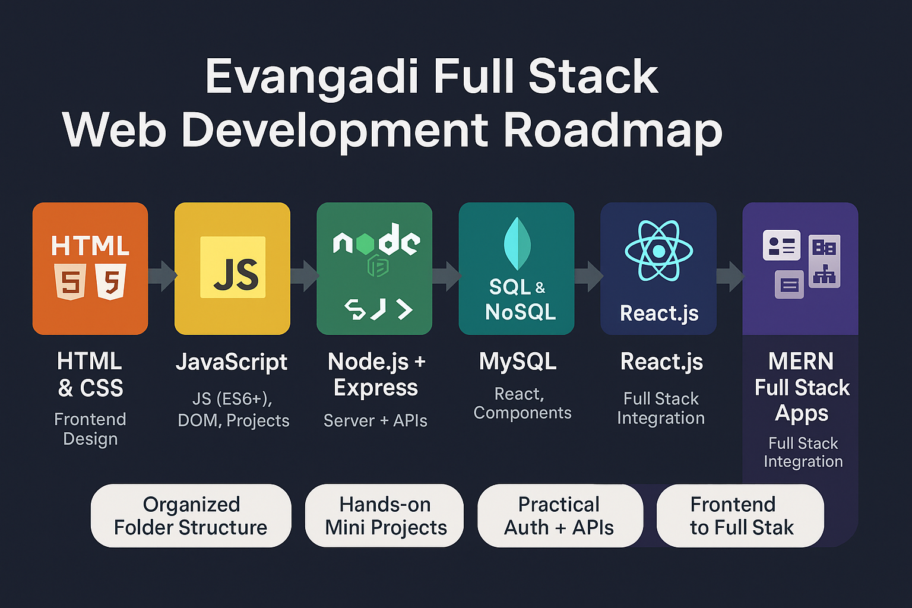

<p align="center">
  
</p>

<h1 align="center">🌍 Evangadi Full Stack Web Development Bootcamp</h1>
<p align="center">
  <b>Complete hands-on journey from Frontend basics to MERN Stack mastery</b><br/>
  💻 Built with dedication by <a href="https://github.com/Leta-Kasahun" target="_blank">Leta Kasahun</a> • 📚 Powered by <a href="https://www.evangadi.com" target="_blank">Evangadi Network</a>
</p>

---

## 🚀 Overview

Welcome to the **Evangadi Full Stack Web Dev Codebase** — a complete, beginner-friendly-to-advanced project archive covering every essential web development skill:

- 🎨 Responsive Frontend design (HTML, CSS, Bootstrap)
- 💡 JavaScript mastery with practical logic building
- ⚙️ Backend APIs with Node.js & Express
- 🗃️ Working with SQL & NoSQL databases (MySQL & MongoDB)
- ⚛️ Building reactive UIs with React.js
- 🔗 Full Stack MERN Projects — from Auth to Deployment

This codebase is more than just files — it's a **career-building journey**!

---

## 🧠 What You’ll Gain

✅ Real understanding of the **web development lifecycle**  
✅ Solid grasp of how **frontend, backend, and databases** work together  
✅ Ability to build and deploy **real-world projects**  
✅ Exposure to **authentication, REST APIs, MVC structure**  
✅ Reusable templates and logic for job interviews or freelance work

---

## 🛠️ Tech Stack Used

| Area             | Technologies                                                                 |
|------------------|-------------------------------------------------------------------------------|
| **Frontend**      | HTML5, CSS3, Flexbox, Bootstrap, JavaScript, React.js                        |
| **Backend**       | Node.js, Express.js                                                          |
| **Databases**     | MySQL, MongoDB,                                                    |
| **Full Stack**    | MERN (MongoDB, Express, React, Node)                                         |
| **Dev Tools**     | Git, GitHub, VS Code                             |

---

## 🌟 Key Features

- ✅ Progressive learning — each topic builds upon the last
- ✅ Clean and well-organized folder structure
- ✅ Mini projects and full stack capstone apps
- ✅ Real-world examples: Auth, CRUD, Dashboards, UI handling
- ✅ Fully responsive and optimized code
- ✅ Easily adaptable into your own portfolio or projects

---

## 📌 Recommended Roadmap

```plaintext
HTML + CSS + Bootstrap
↓
JavaScript (Logic + DOM)
↓
Node.js + Express
↓
MySQL / MongoDB + Mongoose
↓
React.js (Hooks, Routing, Forms)
↓
MERN Full Stack Integration (Auth, Blog, Jobs)
MIT License

Copyright (c) 2025 🌟 **Leta  Kasahun**    

Permission is hereby granted, free of charge, to any person obtaining a copy
of this software and associated documentation files (the "Software"), to deal
in the Software without restriction, including without limitation the rights
to use, copy, modify, merge, publish, distribute, sublicense, and/or sell
copies of the Software, and to permit persons to whom the Software is
furnished to do so, subject to the following conditions:

The above copyright notice and this permission notice shall be included in all
copies or substantial portions of the Software.

THE SOFTWARE IS PROVIDED "AS IS", WITHOUT WARRANTY OF ANY KIND, EXPRESS OR
IMPLIED, INCLUDING BUT NOT LIMITED TO THE WARRANTIES OF MERCHANTABILITY,
FITNESS FOR A PARTICULAR PURPOSE AND NONINFRINGEMENT. IN NO EVENT SHALL THE
AUTHORS OR COPYRIGHT HOLDERS BE LIABLE FOR ANY CLAIM, DAMAGES OR OTHER
LIABILITY, WHETHER IN AN ACTION OF CONTRACT, TORT OR OTHERWISE, ARISING FROM,
OUT OF OR IN CONNECTION WITH THE SOFTWARE OR THE USE OR OTHER DEALINGS IN THE
SOFTWARE.
